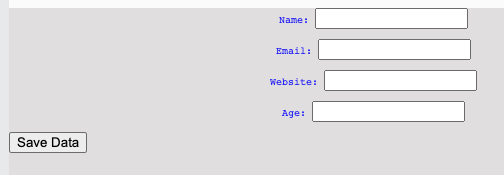

# Yakkety Yak!

Day 79 is all about getting our web pages to talk back to the webserver.

To do this, we build a form which packages up all the data entered into a little dictionary and sends it to the dictionary.
## form
👉 In the current template in `index.html`, delete 'hello world' and add a`<form>` tag to add a form inside the `<body>`.

```html
  <form>
    
  </form>
```
Don't worry. It is suppose to be empty when you hit `run`. Let's fix that.
## method & action


👉 First, we'll add a `post` method which packages the data in the form and sends it to the web server. (Like packaging something in an envelope and sending it through the postal service back to your web server...well kinda).

I'll also add an `action`. This specifies where to send the data. Later on, we'll write some 'process' code in Flask to deal with the data that arrives from the form, so that's the address we'll give now. Don't forget the forward slash.
```html
<form method = "post" action = "/process">
    
</form>
```

## Getting Input

👉 Inside the form, we'll use the `<input>` tag to get the user's name.  Input tags have several types that specify the sort of data they will collect. In this one, we'll use text. **Every** input tag must be given an identifier by setting the `name` property inside the tag.


```html

<form method = "post" action = "/process">
    <p>Name: <input type="text" name="username"> </p>
</form>

```
Refresh and we will see the first input box and text label on our page:


You can type in the text box and press enter, but right now you'll get a 'not found' error. That's because we haven't written the processing code for the form. And we won't. Until tomorrow. So don't worry about it just yet.

## Different Types of Text Box

Here are a few examples of different types of text boxes you can use:

```html
<form>
    <p>Name: <input type="text" name="username"> </p>
    <p>Email: <input type="Email" name="email"> </p>
    <p>Website: <input type="url" name="website"> </p>
    <p>Age: <input type="number" name="age"> </p>
    <p><input type="hidden" name="userID" value="232"> </p>
    
  </form>
```

`hidden` is particularly useful when you have some information that is relevant to the form or back end processing (like user ID), but that the user doesn't necessarily need to see.

## Buttons

👉 Next up, we need a 'submit' button. And the tag, like most HTML tags, is blindingly obvious. Go on, see if you can spot it in the code below:

```html
<form>
    <p>Name: <input type="text" name="username"> </p>
    <p>Email: <input type="Email" name="email"> </p>
    <p>Website: <input type="url" name="website"> </p>
    <p>Age: <input type="number" name="age"> </p>
    <p><input type="hidden" name="userID" value="232"></p>

  <button type="submit">Save Data</button>
    
  </form>
```

Again, there are different types of button that you can specify.

Our page is now looking a bit like this:



