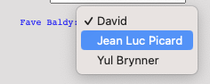

# Required

Putting the `required` attribute inside an `input` tag makes it, erm, well, *required*. ie the user can't leave it blank:

```html
<p>Name: <input type="text" name="username" required> </p>
```
## Drop down... drop down!


👉 To create a drop down menu, you use the `<select>` tag, which works a bit like an unordered list. Each option in the menu is surrounded by `<option>` tags. I've added a drop down to my form here:


```css
<form>
    <p>Name: <input type="text" name="username" required> </p>
    <p>Email: <input type="Email" name="email"> </p>
    <p>Website: <input type="url" name="website"> </p>
    <p>Age: <input type="number" name="age"> </p>
    <input type="hidden" name="userID" value="232"> </p>

    <p>
      Fave Baldy: 
      <select name="baldies">
        <option>David</option>
        <option>Jean Luc Picard</option>
        <option>Yul Brynner</option>
      </select>
    </p>

    <button type="submit">Save Data</button>
  </form>

```

This gives me a lovely little drop down like this:


## Value
However, there's a problem. I haven't told the form how to identify and store the choice. To do this, I have to give each option a value.

```html

<p>
  Fave Baldy: 
  <select name="baldies">
    <option value = "david">David</option>
    <option value = "jean luc">Jean Luc Picard</option>
    <option value = "yul">Yul Brynner</option>
  </select>
</p>
```

### Try it out!