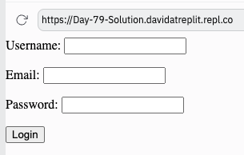

# 👉 Day 79 Challenge

Your challenge today is to make a login form for for a webpage.

Your program should:

1. Take in a username, email address, and password.
2. Have a submit button with the text 'login' on it.
3. Post the data to '/login' as the action when submit button is clicked.

## Example

 
 💡 Hints 

  
- Try using the 'password' type for one of your input boxes and watch what happens.

